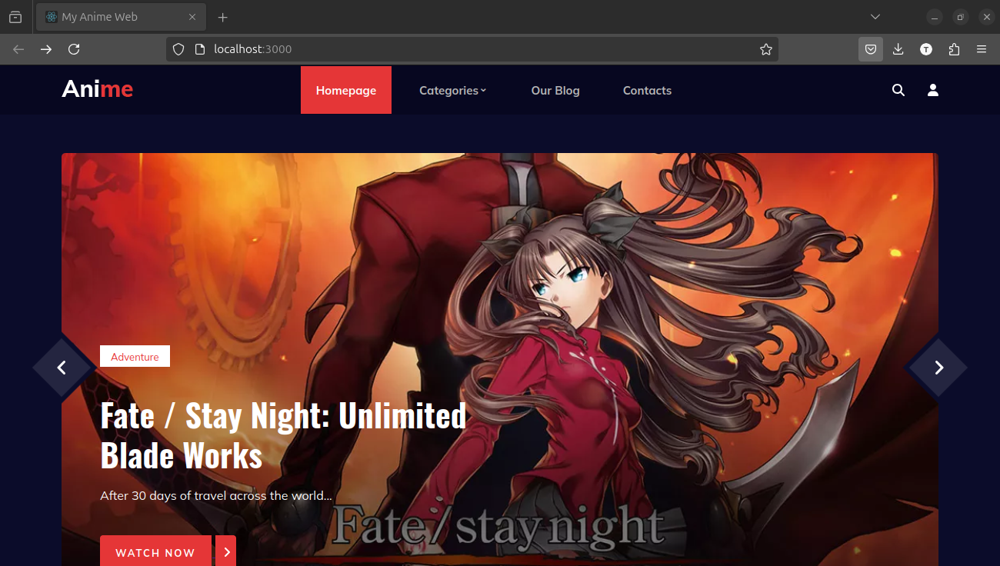
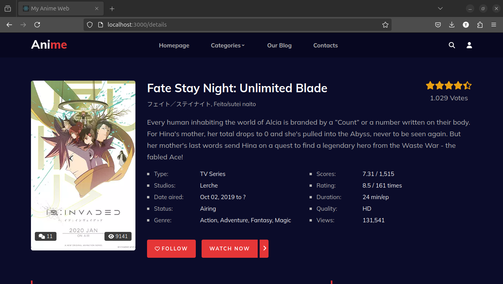
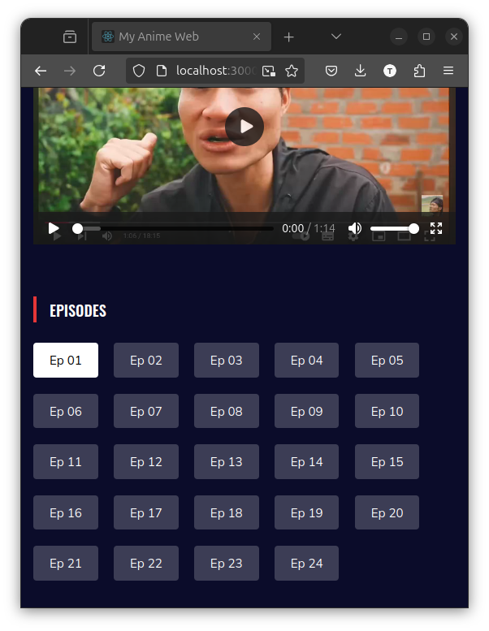

# Description

Anime Web is a web application designed for anime enthusiasts to browse, view, and manage anime series and episodes. It features a modern front-end built with React, providing an interactive and responsive user experience, while the back-end leverages Express.js and MongoDB for robust and scalable data management.

# Demo

# Key Features:

## Frontend (React):

-   Dynamic and user-friendly interface for searching and viewing anime.
-   Responsive design for seamless use on desktop and mobile devices.
-   Components to display anime details, episodes, and user interaction.

## Backend (Express.js):

-   RESTful API for CRUD operations on anime and episodes.
-   Middleware for request validation and error handling.
-   Efficient data transfer between the client and database.

## Database (MongoDB):

-   Stores anime details, episode information, and user interactions.
-   Optimized schema design for quick retrieval and updates.
-   Uses references to link episodes with their corresponding anime.

# Status:

## Frontend:

-   [x] Add User Interface and Styling.
-   [] Use RESTFul API for managing data (On going).

## Backend:

-   [] Adding API routes and database (On going).
-   [] Security and optimization.
